# Computational-Economics

## Code List

`main.py`: where the code should be run.

`OptimalGrowth.py`: Provide a optimal growth model environment and solutions, corresponding to Question 1 in Problem set 1.

`FuncApproxEnv.py`: Provide an environment in which Spline, Polynomial, and Cherbyshev approximation are compared, corresponding to Question 2 in Problem set 1.

`GrowthWithHabitIACEnv.py`: Provide a growth model with habit utility and investment adjustment cost, corresponding to Question 3 in Problem set 1.

`FunctionApprox.py`: Some function approximation tools.

`MarkovApprox.py`: Using finite state Markov process to approximate AR(1) process.

`RandomProcess.py`: Simulation of some random process, AR(1) only up to now.

`utilize.py`: some tools.

## Problem Set 1

### Quetion 1

This is a Solow growth model with AR(1) TFP in Kopechy and Suen (2010).
I use the parameters in their paper.
The main code is in `OptimalGrowthEnv.py`.

#### Solving a optimal growth model with Chebyshev approximation and grid search

The main code for this problem is `OptimalGrowthEnv().grid_search()`.
I use Chebyshev method to approximate the value function, and search for the optimal consumption to maximize the RHS of the Bellman equation.

The AR(1) TFP is approximated by a 7-state Markov process using Rowenhorst method.
The number of grids for capital is 15.
The domain of the solution is [0.5, 1.5] * steady state capital.
And the precision of optimal consumption is 0.01.

Following is the optimal consumption, capital accumulation, and value function: 

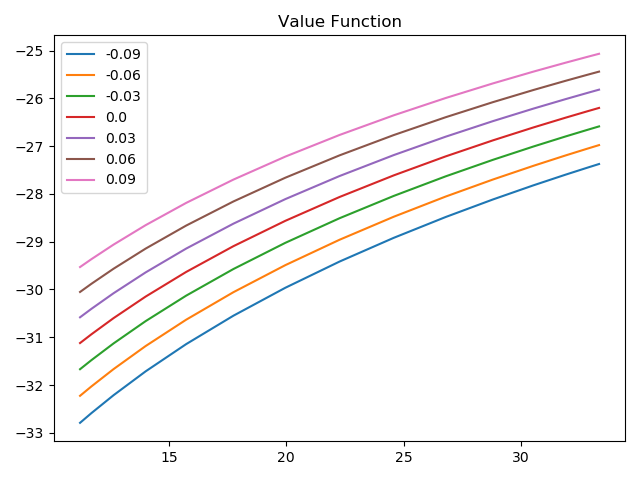
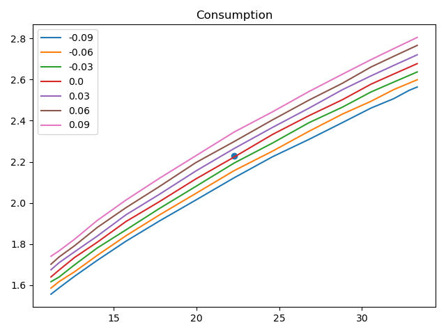
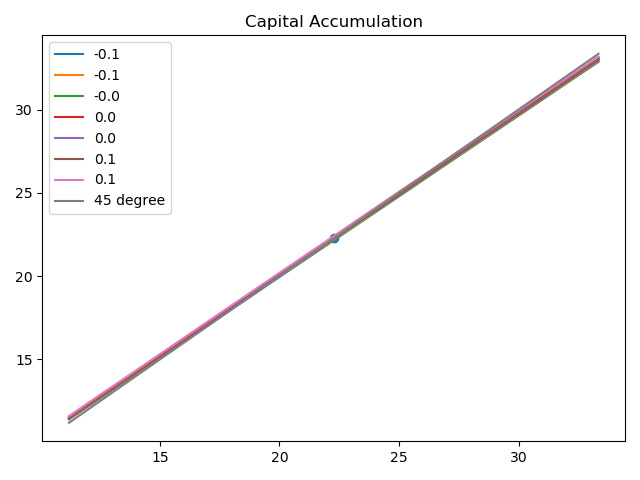

The X-axis is for capital, and the lines with different colors represent different TFP levels.

#### Solving a optimal growth model with Chebyshev approximation and euler equation

The main code for this problem is in `OptimalGrowthEnv().Euler_method()`.
I use Chebshev method to approximate the consumption function given present capital and TFP.
Then I use RHS of Euler equation to update the consumption function.

The setting and parameters are the same as the last problem.
Following is the solution:

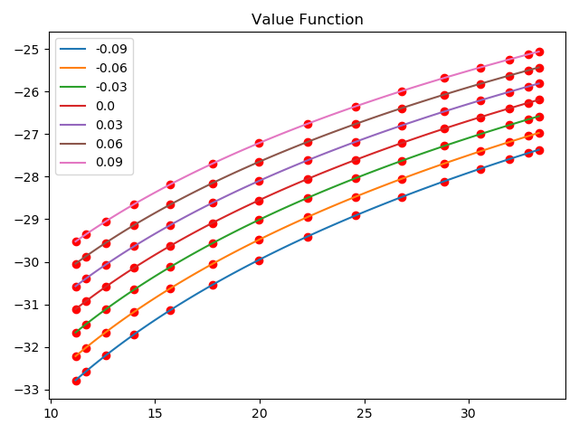
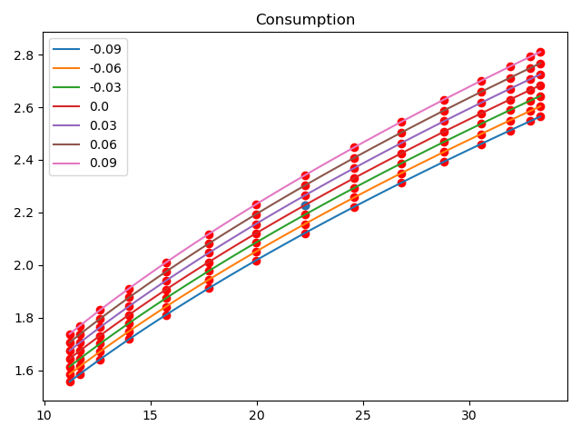
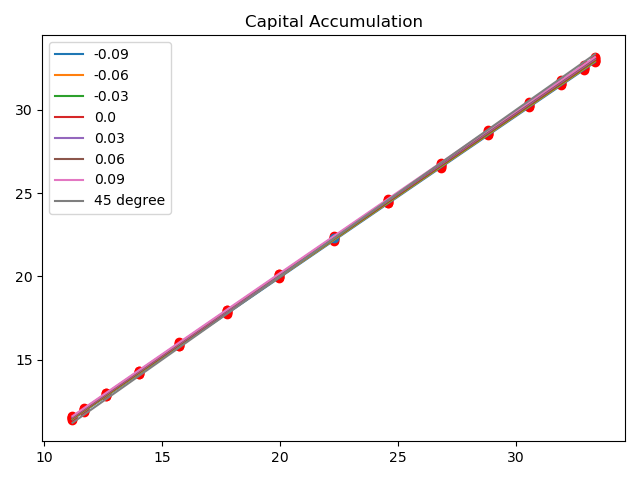

The red points are the evaluation on the grid points.

Since the grid width is sufficiently small, it seems that there is not significant difference between the solution 2 methods.
But the consumption seems to be less smooth in grid search.
And the first method is more time-consuming.

#### Replication of Table 2 in Kopecky and Suen (2010)

I use the euler method to replicate Table 2 in their paper.
I compute the first 3 lines by the transition probability matrix.
The remaining statistics are computed by Monte-Carlo simulation.
I choose Rowenhorst with 25 grids to be the quasi-exact solution rather than the ChebshevPEA solution in their paper.
The simulation length is 5,010,000, and the first 10,000 periods are burned.
Following is the main results.

| index | T(5) | T(10) | T(25) | TH(5) | TH(10) | TH(25) | R(5) | R(10) | R(25) | 
| :----: | :----: | :----: | :----: | :----: | :----: | :----: | :----: | :----: | :----: | 
| rho | 0.94898130053 | 0.95585857843 | 0.97727293239 | 0.95844571325 | 1.202396276442 | 1.39588065992 | 0.96024921387 | 0.9942382865 | 1.0 |
| sigma_epsilon | 0.77923377279 | 1.08625798458 | 1.01065710145 | 0.00063537862 | 1.843916779423 | 2.81707903496 | 0.95959602138 | 0.9918961180 | 1.0 |
| sigma_a | 1.00004735360 | 0.99999604701 | 0.99999455111 | 2.08977903004 | 1.548634271543 | 1.31392411780 | 1.00001461105 | 0.9999951529 | 1.0 |
| sigma_k | 0.89806027520 | 1.04680473655 | 1.00942781110 | 0.64053238759 | 0.551646989145 | 0.55513990269 | 1.00001949359 | 1.0000061654 | 1.0 | 
| sigma_ak | 0.89792725203 | 1.04682151520 | 1.00944041872 | 0.64044090526 | 0.200321072768 | 0.47420857946 | 1.00002105513 | 1.0000066325 | 1.0 | 
| sigma_y | 0.96437238943 | 1.01645768151 | 1.00331157585 | 0.87612249500 | 0.760124266050 | 0.82846823907 | 1.0000071471 | 1.0000022552 | 1.0 | 
| sigma_c | 0.98944667059 | 1.00569409138 | 1.00111552301 | 0.96963293461 | 1.054773269722 | 0.99723316786 | 1.00000253118 | 1.0000007945 | 1.0 | 
| sigma_i | 0.89694175999 | 1.04651655039 | 1.00935186161 | 0.63906937263 | 0.878844868512 | 0.69644647584 | 1.00002184652 | 1.0000068212 | 1.0 | 
| rho_y | 0.99999999556 | 1.00000000179 | 1.00000000039 | 0.99999997138 | 0.999999782849 | 0.99999991439 | 1.00000000000 | 1.0000000000 | 1.0 | 

The results are similar to Kopecky and Suen's paper.
In the case of moment approximation, Rowenhorst's performance is best and Tauchen Hussey is the worst.
As the number of grids increases, Tauchen and Rowenhorst converges to the quasi-exact results.
The Tauchen Hussay method doesn't converge as the original paper shows.
The reason may be that Python suffers more from numerical errors than Matlab.

### Question 2

The main code is in `FuncApproxEnv.py`.

`FuncApproxEnv().validate(n)`: Compare Spline, Polynomial, and Cherbyshev approximation with `n` grids.
The approximated function is f(x) = alpha * beta * x ^ alpha, with alpha=0.3 and beta=0.98.

The approximation result is following:

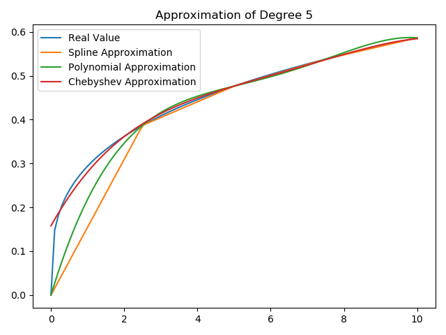
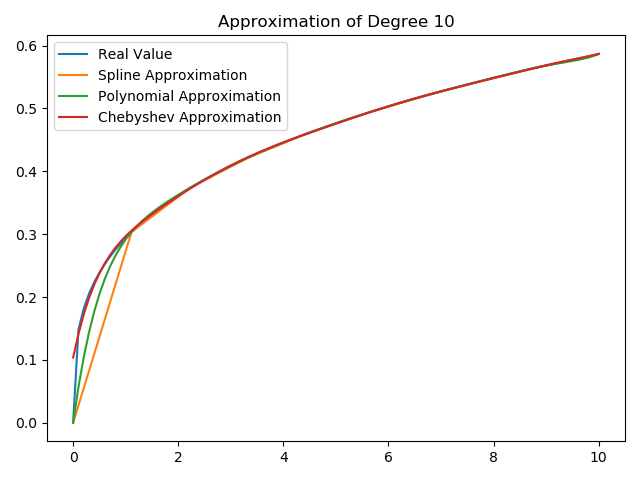

The computing time and maximum absolute error is in the following table:

| Method | Spline(5) | Polynomial(5) | Chebyshev(5) | Spline(10) | Polynomial(10) | Chebyshev(10) |
| :----: | :----: | :----: | :----: | :----: | :----: | :----: |
| Computational Time | 0.0 | 0.0009911060333 | 0.0 | 0.0 | 0.0 | 0.0010030 |
| Maximum Absolute Error | 0.161465698189 | 0.1287999140712 | 0.1579644117 | 0.12678461317 | 0.091126894848 | 0.10377239873|

The computional time is neglectable since the number of basis function is small.

Chebyshev and Polynomial approximation can capture the curvature of the function, so both of them perform better than Spline in term of errors.
This function is kind of ill-behaved because that its all order of derivatives is infinite at 0, so the information at 0 is important.
Because Chebyshev approximation doesn't take grids at the endpoints, so there is a large error at 0. 

### Question 3

The simulation path and the decision rule given the original parameters is:

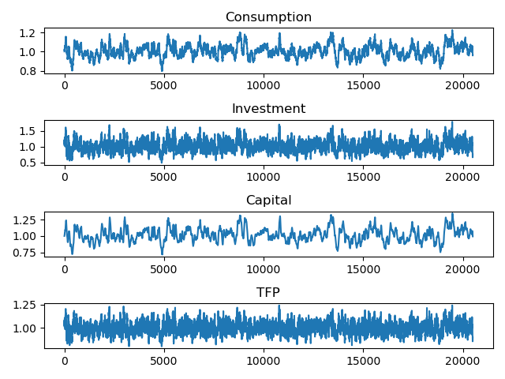
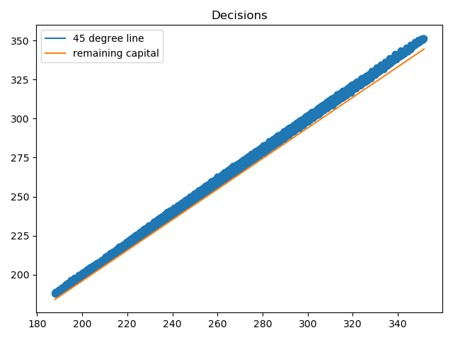

The remaining capital line is y = (1 - delta) * k.
All the variables are normalized by steady states.

The simulation path and the decision rule given b=0.1 is:

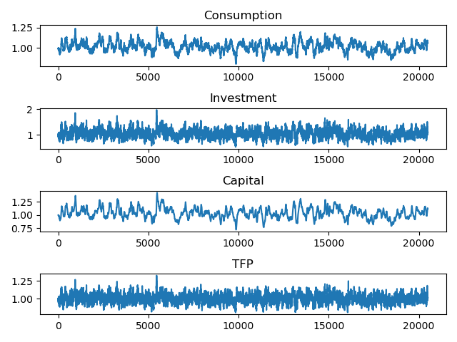
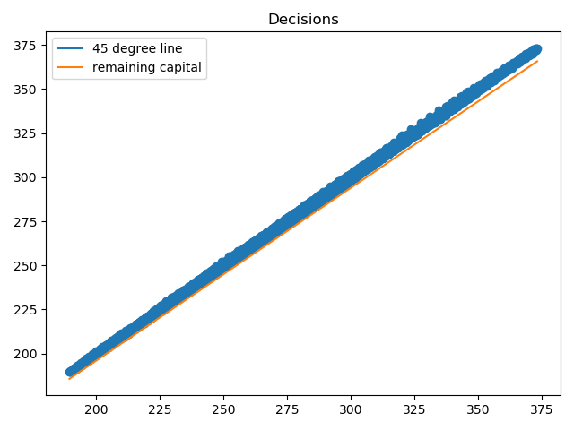

The simulation path and the decision rule given phi=0.03 is:

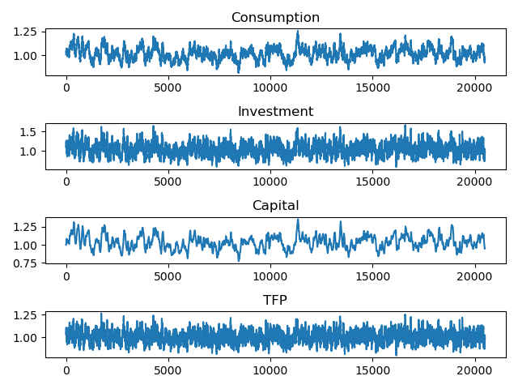
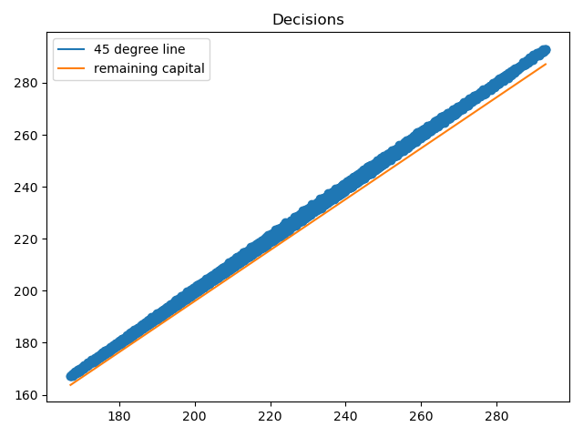

The simulation path and the decision rule given b=0.01 and phi=0.03 is:

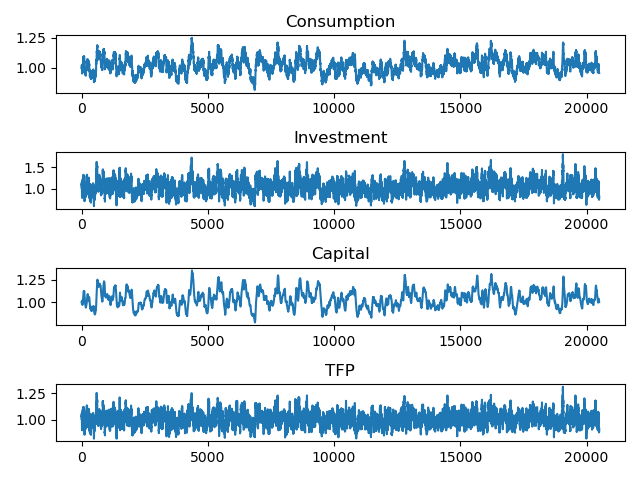
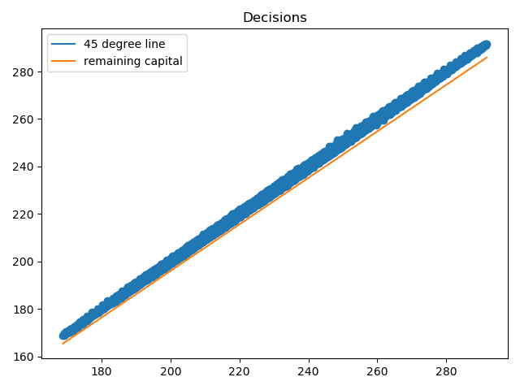

It seems that the irreversibility constraint is never binding with the original parameters.
So the solution to the OBC problem is similar to the problem with no constraint.

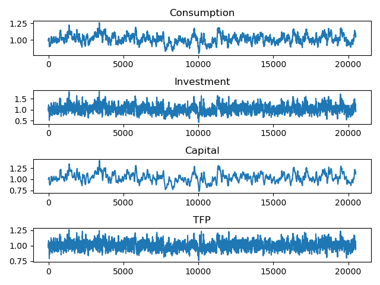
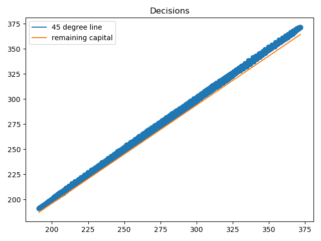

Since the correlation between state variables c[t-1] and k[t] is high, only k[t] is used in PEA.

Comparing the results in the first 2 problems, we can see that the dispersion of investment is larger if the habit coefficient is higher.
This result shows that the habit utility can smooth the consumption path by increasing the volatility of investment.

Comparing the results in the problem 1 and problem 3, we can see that the dispersion of capital is larger if the investment adjustment cost is smaller.
This result shows that the investment adjustment cost smooth the capital path.

The fourth results mix the 2 channels. 

The above results are based on PEA with the first order, i.e. the expectation only dependent on log(k) and log(a).
When the second order term log(k)log(a), log(k)^2, log(a)^2, are added to the regression, the regression became unstable.
Below is the path of the coefficient of constant.

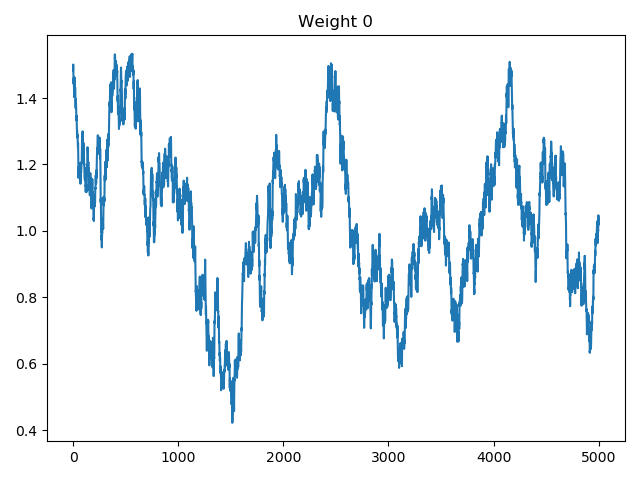

We can see the coefficient doesn't converge.
The overall R^2 is high, so I think there is not much curvature to be captured by higher order terms.
The graph of decision rule also shows that the decision rule is almost linear.